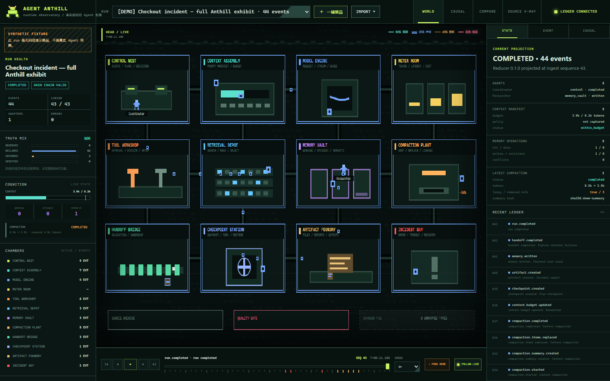
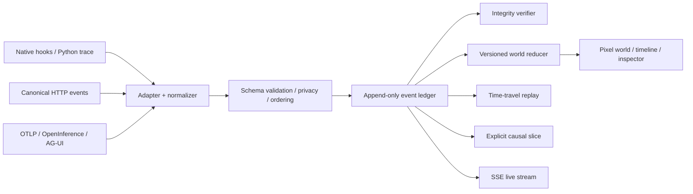
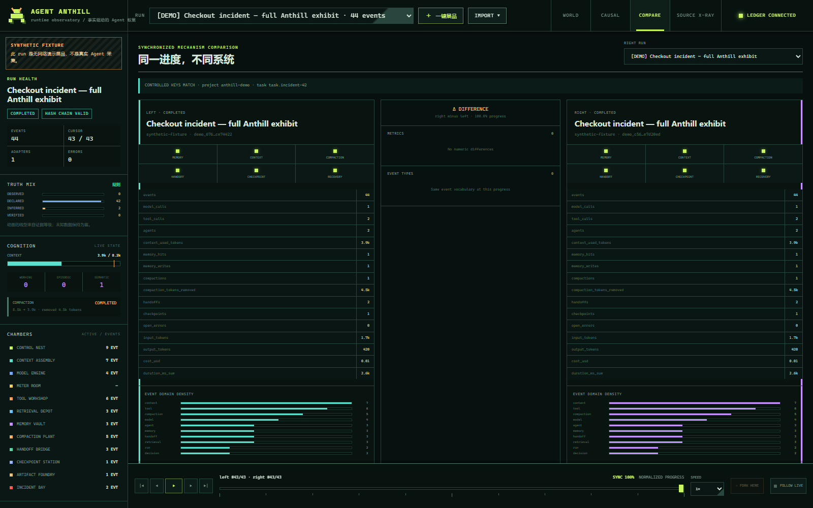

# Agent Anthill

**A truth-aware, time-travel observatory for AI agents.**
把 Agent 的任务、工具、上下文、记忆、压缩、协作与错误恢复，投影成一个可以逐层钻取证据的像素蚁巢。



> Alpha · application `0.4.0` · event protocol `0.1.0`
> Python runtime tracing, OTLP/OpenInference import, and AG-UI JSON/NDJSON import work today. Framework-native live adapters remain the next expansion, not a claim hidden behind the UI.

Most agent visualizers answer “what looks busy?” Agent Anthill is built to answer harder questions:

- What **actually happened**, in authoritative ingest order?
- Which state is observed, declared in code, inferred, or counterfactually verified?
- Why did an agent move from planning to a tool, hand off work, compact context, or recover from an error?
- What did compaction keep, replace, and remove?
- Can every visual object lead back to its event, span, source line, payload, and hash-chain evidence?
- What did the system look like at event 17—not only at the end?

The pixel world is a semantic projection over an append-only event ledger. It is not the source of truth.

## What works now

- Original 12-chamber pixel world rendered locally with Canvas; no copied game assets.
- Four truth levels with distinct visual grammar:
  - `observed` — captured directly at runtime;
  - `declared` — explicit in source/configuration;
  - `inferred` — fallible interpretation, always below 100% confidence;
  - `counterfactual_verified` — validated by a recorded intervention and rerun.
- Canonical, versioned `AgentRuntimeEvent` envelope with causal links, clocks, source fidelity, privacy policy, artifacts, measurements, and extensions.
- Python AST importer that keeps code declarations separate from semantic classification.
- Python `sys.settrace` runtime adapter that preserves observed calls and emits semantic hints as separate inferred events.
- OTLP JSON/OpenInference importer for `AGENT`, `LLM`, `TOOL`, `RETRIEVER`, `RERANKER`, `EMBEDDING`, `GUARDRAIL`, and `EVALUATOR` spans, with convention/version retention and content redaction.
- AG-UI JSON/NDJSON importer for run, step, message, tool, shared state, activity, and public reasoning-summary lifecycles. Explicit stream IDs become causal/correlation links; content and encrypted reasoning values are redacted by default.
- Thread-safe local JSONL ledger with duplicate rejection, monotonic ingest sequence, SHA-256 hash chain, integrity verification, and per-run manifests.
- Deterministic world reducer and historical projection at any ingest sequence.
- Immutable, reducer-versioned world snapshots anchored to ledger event hashes; corrupt caches are ignored and recomputed from the ledger.
- Side-effect-free materialized forks from any timeline cursor, with parent event/state hashes and remapped provenance links.
- Explicit causal slices that never turn temporal adjacency into causation.
- Synchronized two-run comparison with normalized progress, mechanism/metric diffs, and comparability warnings when project/task keys do not match.
- Context budget, memory layers, compaction lineage, handoff, checkpoint, artifacts, usage, and incident projections.
- FastAPI ingestion/query/replay/integrity APIs plus live SSE with gap detection and ledger resync.
- Source X-Ray view for the original static call graph and real Python execution trace.
- One-click, clearly labelled **synthetic fixture** covering all core chambers without network or model calls.
- Metadata-only persistence by default; prompt, argument, return, and exception content require explicit opt-in.
- 51 tests covering schema invariants, privacy, adapters, time travel, snapshots, branching, comparison, causality, tamper detection, concurrent append, and API behavior.

## Quick start

Python 3.11+ is recommended.

```bash
python -m venv .venv

# Windows
.venv\Scripts\activate

# macOS / Linux
source .venv/bin/activate

pip install -r requirements.txt
python server.py
```

Open <http://127.0.0.1:8765> and click **一键展品**. The fixture is marked `SYNTHETIC FIXTURE` in both its manifest and every event.

For a real local Python trace, open <http://127.0.0.1:8765/graph>, analyze `samples`, select an entry point, and run **实时运行**. The trace endpoint persists a metadata-only Anthill run by default.

Or run the hardened local container profile:

```bash
docker compose up --build
```

The Compose profile binds only to `127.0.0.1:8765`, runs as a non-root user with a read-only root filesystem, and persists ledgers in the `anthill-data` volume. Image build/runtime smoke is also exercised in CI when a Docker runner is available; on a machine without Docker it remains an environment-dependent check.

## The trust contract

```text
pixel object
  └─ world projection @ reducer_version + ingest_seq
      └─ canonical event_id + explicit causation/link
          └─ source adapter + fidelity + confidence
              └─ raw event / trace span / source line / artifact hash
```

Unknown information stays in **Unknown Fog**. Missing telemetry never becomes a confident animation. The project does not expose private chain-of-thought; it only renders framework-provided plans, reasoning summaries, and observable operations.

## Architecture



The current local store is JSONL for inspection and shareable exhibits. Its interface is deliberately small so a PostgreSQL + outbox backend can replace it for multi-process production ingestion. Kafka is not required for the local-first product.

Read [architecture](docs/ARCHITECTURE.md), [event protocol](docs/EVENT_PROTOCOL.md), and [adapter guide](docs/ADAPTER_GUIDE.md) before adding a framework integration.

## Ingest canonical events

Any runtime can integrate today by posting canonical events. Native adapters should preserve the original semantic-convention version in `source`.

```bash
curl -X POST http://127.0.0.1:8765/api/anthill/runs/example/events \
  -H "Content-Type: application/json" \
  -d '{
    "events": [{
      "schema_version": "0.1.0",
      "event_id": "evt-tool-start",
      "event_type": "tool.execution.started",
      "run_id": "example",
      "source": {
        "adapter": "my-runtime",
        "adapter_version": "0.1.0",
        "framework": "my-framework",
        "fidelity": "native"
      },
      "evidence": {"level": "observed", "confidence": 1.0},
      "subject": {"kind": "tool.call", "id": "call-7", "name": "web_search"},
      "privacy": {"content": "metadata_only"},
      "payload": {"tool": "web_search"}
    }]
  }'
```

Useful endpoints:

| Endpoint | Purpose |
|---|---|
| `GET /api/anthill/schema` | Protocol vocabulary and truth contract |
| `POST /api/anthill/runs/{run_id}/events` | Validated batch ingestion |
| `POST /api/anthill/import/otlp` | OTLP JSON/OpenInference span import |
| `POST /api/anthill/import/agui` | AG-UI JSON or NDJSON event import |
| `GET /api/anthill/runs/{run_id}/events` | Ordered, paginated event query |
| `GET /api/anthill/runs/{run_id}/world?at_seq=17` | Historical world projection |
| `POST/GET /api/anthill/runs/{run_id}/snapshots` | Create/inspect projection snapshots |
| `POST /api/anthill/runs/{run_id}/fork` | Materialize a no-rerun branch at a cursor |
| `GET /api/anthill/runs/{run_id}/replay` | Replay window with initial/final state |
| `GET /api/anthill/runs/{run_id}/causal/{event_id}` | Explicit causal neighborhood |
| `GET /api/anthill/runs/{run_id}/integrity` | Full hash-chain verification |
| `GET /api/anthill/runs/{run_id}/stream` | SSE live events with sequence-gap recovery |
| `GET /api/anthill/compare` | Normalized two-run mechanism comparison |
| `POST /api/anthill/demo` | No-network synthetic exhibit |

Interactive API documentation is available at `/docs`.

## Semantic chambers

| Chamber | Canonical domains |
|---|---|
| Control Nest | run, agent, task, plan, decision, policy |
| Context Assembly | manifest items, token budget, truncation, overflow |
| Model Engine | request, stream, cache, retry, fallback, usage |
| Tool Workshop | request, approval, execution, side effect, retry |
| Retrieval Depot | query, candidates, rerank, selected documents |
| Memory Vault | working, episodic, semantic memory operations |
| Compaction Plant | trigger, summary, replacements, kept/removed lineage |
| Handoff Bridge | proposal, acceptance, ownership, context manifest |
| Checkpoint Station | create, restore, fork, commit, invalidate |
| Artifact Foundry | files, reports, code, structured outputs |
| Incident Bay | failure, timeout, cancellation, recovery |
| Meter Room | token, duration, cost, and budget measurements |

Source Archive shows code-level events; unmapped extensions remain in Unknown Fog until an adapter or projector explicitly understands them.

## Compare without causal overclaiming



Compare mode synchronizes two ledgers by normalized progress and reports mechanism, metric, and event-vocabulary differences. Shared `project_id` and `task_id` are surfaced as comparability keys; a mismatch produces a warning. Matching keys still do not prove that model version, tool fixture, code, or environment were controlled.

## Development

```bash
pip install -r requirements-dev.txt
pytest -q
ruff check --no-cache .
node --check static/js/anthill.js
```

The dependency-free Chrome DevTools helper can capture the UI for visual review with Node.js 22+:

```bash
node scripts/cdp_capture.mjs <websocket-url> output.png http://127.0.0.1:8765/?static=1
```

See the checked [environment matrix](docs/ENVIRONMENT_CHECKLIST.md) for verified versions and explicitly pending runtime dependencies.

## Roadmap

Near-term, in order:

1. OTLP protobuf/live receiver, AG-UI live stream bridge, and instrumentation-coverage maps across locked protocol versions.
2. Native LangGraph adapter, then Claude Code and Codex hook providers.
3. Reference-based branch DAG and snapshot compaction policy for very long runs (the current local fork is safely materialized).
4. Stub replay, side-effect manifests, and sandboxed downstream reruns.
5. Queryable alerts, latency/error budgets, and Prometheus-compatible monitoring exports.
6. PostgreSQL/outbox store for multi-process deployment.
7. Contributor gallery of versioned, reproducible Agent exhibits.

See [product principles](docs/PRODUCT.md) for success criteria and explicit non-goals.

## Security and privacy

Agent traces can contain secrets, personal data, source code, and side effects. Agent Anthill is local-first and defaults to metadata-only persistence. Real replay is not implemented yet; recorded tool results are visualization evidence, not permission to repeat an external operation.

Read [security and privacy](docs/SECURITY_AND_PRIVACY.md) and report vulnerabilities according to [SECURITY.md](SECURITY.md).

## Contributing

The most valuable contribution is not another animation. It is a well-specified adapter with:

- a golden trace fixture;
- schema conformance tests;
- known blind spots and instrumentation coverage;
- explicit fidelity and confidence mapping;
- no unlicensed art or private trace content.

Start with [CONTRIBUTING.md](CONTRIBUTING.md).

## License and name

Code is licensed under Apache-2.0. Original UI graphics are generated from project code and covered by the same repository license unless an asset manifest says otherwise.

Agent Anthill is an independent open-source project and is not affiliated with Anthill AI, AnthillPro, or the historical Anthill P2P framework. “Agent Anthill” is the complete project name used here.
