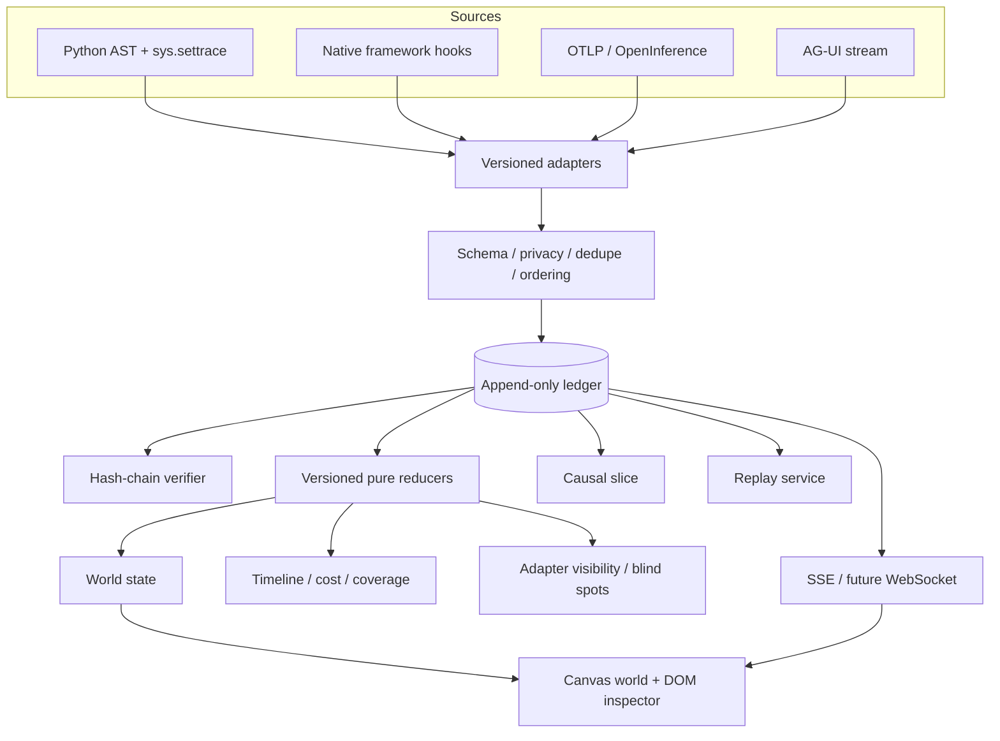

# Architecture

## System boundary

Agent Anthill is an observability and learning layer. It does not own the Agent loop. Source runtimes emit or expose facts; adapters normalize those facts; the append-only ledger preserves them; versioned projectors build views.

## Layer responsibilities

### 1. Source adapter

Converts a source-specific event into `AgentRuntimeEvent`. It must record framework/version, adapter version, source fidelity, raw reference, and semantic-convention version when applicable.

Adapters do not draw pixels. They do not silently promote inferred semantics to observed facts.

Implemented inputs are Python AST, Python `sys.settrace`, canonical HTTP events, OTLP JSON/OpenInference import, and AG-UI JSON/NDJSON import. OTLP protobuf, a standard live `/v1/traces` collector endpoint, and an AG-UI HTTP/SSE subscriber are not implemented yet.

### 2. Validation and privacy

Pydantic validates the stable envelope. Inferred evidence cannot claim confidence `1.0`. Timestamps must be timezone-aware. Event types are open, lowercase namespaces so framework extensions can survive before the core understands them.

Content capture defaults to `metadata_only`. An adapter may hash or store large content as an artifact reference; it should not put an entire prompt into the envelope by default.

### 3. Event ledger

The local implementation partitions JSONL by run and assigns authoritative `ingest_seq`. Each stored event contains the previous event hash and its own SHA-256 hash. Duplicate event IDs are rejected.

The JSONL backend is thread-safe and single-process by design. The manifest is a rebuildable index, not the source of truth.

The production backend target is PostgreSQL:

- immutable event table with unique `event_id` and `(run_id, ingest_seq)`;
- event insert and outbox insert in one transaction;
- at-least-once delivery with event-ID deduplication;
- object storage for large encrypted artifacts;
- snapshots keyed by run, reducer version, and sequence;
- optional NATS JetStream/Kafka/ClickHouse only after measured scale requires them.

### 4. Projectors

`reduce_world(state, event) -> new_state` is deterministic and does not mutate its input. A projection records `reducer_version`, cursor sequence, and cursor event.

The same ledger therefore supports:

- live head projection;
- historical state at any sequence;
- checkpointed replay for long runs;
- comparison under the same reducer;
- state-hash verification.

The local implementation now stores immutable world snapshots keyed by run, reducer version, and sequence. A snapshot includes the reducer state hash and the hash of its anchor ledger event. If either check fails, projection falls back to the ledger and reports a warning. Snapshots are caches, never replacement facts.

The local branch implementation materializes a parent prefix into a new ledger, remaps event/causal identity, adds `derived_from` links to the parent, records the parent state hash, and appends `run.forked`. It never executes a model or tool. A future database backend should represent branches as parent snapshot + tail DAG to avoid copying long prefixes.

Pixel rendering consumes world state. It cannot update authoritative state itself.

Instrumentation visibility is a projection, not a score. It combines the event families recorded at the current cursor with versioned built-in adapter capability contracts. The state name `observed` means “an event or metric signal is present in the ledger,” not that every event has `evidence.level=observed`; the truth mix remains a separate dimension. The other states are `observable_not_seen` and `outside_adapter_contract`; “not seen” is never treated as proof that an operation did not occur. Third-party adapters without a registered contract are shown as unregistered.

### 5. Delivery

SSE is sufficient for the current server-to-browser event stream. The browser subscribes before backlog read; duplicates are removed by sequence. A slow consumer may lose wake-up notifications, but sequence gaps trigger ledger resync, so the ledger remains authoritative.

WebSocket becomes useful only for bidirectional collaboration, replay control shared across users, or high-frequency binary updates.

## Identity, time, and causality

Four concepts are intentionally separate:

- `event_id` — global idempotency key;
- `source_seq` — order assigned by the source adapter when available;
- `ingest_seq` — authoritative append order inside one run;
- `occurred_at` / `observed_at` / `monotonic_ns` — clocks with different meaning.

Concurrency is a DAG, not a list. `causation_id` and explicit links encode causal/dependency claims. `trace_id`, `span_id`, and `parent_span_id` encode tracing structure. Temporal adjacency alone creates no edge.

## Static and dynamic evidence

The Python AST adapter emits:

1. `code.entity.declared` for the source-level fact;
2. `semantic.entity.classified` for the heuristic interpretation.

The runtime adapter emits:

1. observed `code.call.started/returned/raised` events;
2. optional inferred semantic companion events such as `tool.execution.started`.

If the classifier is wrong, the observed trace remains intact and can be reprojected after a classifier upgrade.

## Replay definitions

The word replay is overloaded, so the architecture reserves three levels:

1. **Visual replay (implemented):** deterministic reducers reconstruct views from recorded events.
2. **Stub replay (planned):** model/tool responses are injected from the ledger to debug orchestration without side effects.
3. **Real rerun (planned):** downstream systems are called again. It is nondeterministic and must run in a sandbox with idempotency keys and explicit side-effect policy.

## Scaling path

The first performance breakpoint is usually projection cost, not transport. Versioned snapshots are created after a configured event interval or checkpoint, then projection replays only the tail. Token chunks can be preserved in storage but batched per animation frame for rendering.

The current UI queries at most 5,000 events per page. Large-run pagination, server-side stage grouping, and snapshot caching are required before claiming production-scale history.

## Container boundary

The repository includes a local hardened container profile: non-root UID/GID `10001`, read-only root filesystem, dropped Linux capabilities, `no-new-privileges`, bounded PIDs/logs, loopback-only host binding, and a dedicated writable ledger volume. CI builds that image and proves the health endpoint, process UID, and a real ledger write.

This reduces accidental host exposure; it does not add authentication, tenant isolation, TLS, or a sandbox around Python trace execution. The container is therefore a reproducible local deployment, not evidence of hosted-service readiness.

## Compatibility strategy

OpenTelemetry GenAI semantic conventions, OpenInference, and AG-UI are valuable inputs but still evolve. Agent Anthill aligns through versioned adapters and stores the input convention/version; none of them is the immutable internal contract.
