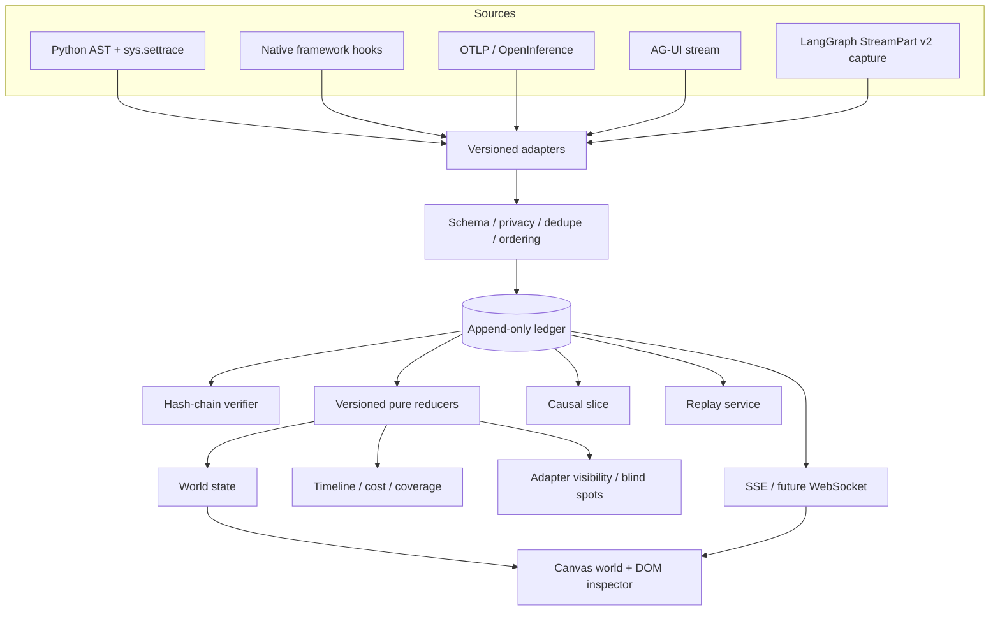
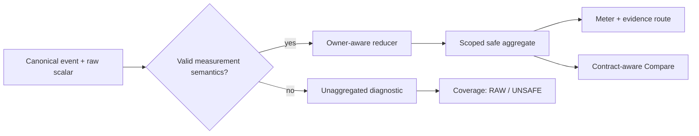

# Architecture

## System boundary

Agent Anthill is an observability and learning layer. It does not own the Agent loop. Source runtimes emit or expose facts; adapters normalize those facts; the append-only ledger preserves them; versioned projectors build views.

## Layer responsibilities

### 1. Source adapter

Converts a source-specific event into `AgentRuntimeEvent`. It must record framework/version, adapter version, source fidelity, raw reference, and semantic-convention version when applicable.

Adapters do not draw pixels. They do not silently promote inferred semantics to observed facts.

Implemented inputs are Python AST, Python `sys.settrace`, canonical HTTP events, OTLP JSON/OpenInference import, AG-UI JSON/NDJSON import, and LangGraph 1.x StreamPart v2 JSON/NDJSON import with a tested `1.1.0` floor.

The LangGraph adapter maps an already captured, JSON-compatible v2 stream. It does not import LangGraph at runtime, instrument a graph automatically, or subscribe to a running graph. OTLP protobuf, a standard live `/v1/traces` collector endpoint, an AG-UI HTTP/SSE subscriber, and a LangGraph live capture bridge are not implemented yet.

### 2. Validation and privacy

Pydantic validates the stable envelope. The current event schema is `0.2.0`:
new run IDs cannot contain leading/trailing whitespace or Unicode `Cc`/`Cf`
control and format characters. It also rejects `/`, `\`, `?`, `#`, `%`, and
the exact dot segments `.` and `..`, making each new run ID one stable API path
segment. An explicit internal context keeps existing `0.1.0` ledger records
readable, but it is storage-only; new ingestion and append remain strict, and
unsafe legacy IDs are omitted from normal discovery.
Inferred evidence cannot claim confidence `1.0`. Timestamps must be timezone-aware. Event types are open, lowercase namespaces so framework extensions can survive before the core understands them.

Content capture defaults to `metadata_only`. An adapter may hash or store large content as an artifact reference; it should not put an entire prompt into the envelope by default.

Metadata-only is a content policy, not an anonymity guarantee. Run/thread/task/message/checkpoint IDs, namespaces, node and field names, patch paths, model metadata, and source references can remain visible because they are needed to correlate evidence. Oversized external LangGraph interrupt IDs are replaced by stable hashes while their original character count is retained.

### 3. Event ledger

The local implementation partitions JSONL by run and assigns authoritative `ingest_seq`. Each stored event contains the previous event hash and its own SHA-256 hash. Duplicate event IDs are rejected.

The JSONL backend is in-process thread-safe and single-process by design. A
process-local append index caches event IDs and the validated head together with
an unkeyed SHA-256 of the complete ledger bytes. Every append hashes the current
ledger before consulting that cache. The first access, or any changed digest,
triggers full JSON parsing plus sequence, duplicate-ID, and event-hash-chain
validation; an unchanged digest can reuse the validated index. The digest is
refreshed after append. It is a cache-invalidation/change-detection value, not a
MAC or a substitute for the event hash-chain verifier.
This describes append-index reuse. Missing, malformed, checksum-invalid, or
stale-behind manifest caches can independently trigger a complete
validated-ledger rebuild. A checksum-valid manifest whose event count is ahead
of the ledger, or whose equal-count HEAD hash diverges, is instead a damage
anchor: the run is quarantined as `truncated_ledger` or `divergent_ledger` and
is never silently rebuilt.

This design avoids reparsing every JSON event on an unchanged ledger, but it
still scans the ledger bytes on every append. Repeated single-event appends to a
growing run therefore have cumulative `O(k²)` byte-scanning cost. That is a
source-derived complexity bound, not a throughput benchmark. Batch ingestion
amortizes the scan; very long or multi-process production runs require the
transactional backend below.

The manifest is a checksummed, rebuildable cache, not the source of truth or a
security MAC. `GET /api/anthill/runs` performs lightweight discovery and reports
`integrity_status: "not_checked"`; full sequence, ID, and hash-chain verification
belongs to the per-run integrity endpoint. Its scope is explicitly
`discovery_boundary`. Discovery returns at most 100 diagnostic records while
retaining the total count and a truncation flag. Each `ledger_ref` is `ledger:`
plus 24 hexadecimal characters, a 96-bit truncated SHA-256 correlation reference
derived from the ledger directory name—not a run ID, credential, or security
strength claim.

The 100-record diagnostic cap and 64 process-local lock stripes are initial
defensive engineering values, not benchmark-derived capacity claims. They
remain subject to workload measurement before any hosted multi-tenant use.

When a valid checksummed manifest proves that the prior head was non-empty,
discovery intentionally classifies a shortened ledger, an empty ledger, and a
missing ledger alike as `truncated_ledger`. The missing-ledger path is diagnostic
only: it does not recreate `events.jsonl` or reinterpret lost history as a new
empty run. Without a valid manifest head, the rebuildable cache cannot prove
that truncation occurred.

The manifest supplies HEAD discovery facts; event, replay, world, comparison,
and causal response bodies still come from the ledger. Normal reads execute the
same valid-manifest HEAD-anchor check before treating a missing ledger as an
unknown run. A checksum-valid ahead or divergent anchor therefore quarantines
the run with a privacy-safe `409` instead of allowing one endpoint to return a
stale prefix while another reports damage.

The production backend target is PostgreSQL:

- immutable event table with unique `event_id` and `(run_id, ingest_seq)`;
- event insert and outbox insert in one transaction;
- at-least-once delivery with event-ID deduplication;
- object storage for large encrypted artifacts;
- snapshots keyed by run, reducer version, and sequence;
- optional NATS JetStream/Kafka/ClickHouse only after measured scale requires them.

### 4. Projectors

`reduce_world(state, event) -> new_state` is deterministic and does not mutate its input. A projection records `reducer_version`, cursor sequence, and cursor event. The current reducer is `0.4.0`; it shares one explicit run-lifecycle fold with manifest reconstruction, while snapshots produced by earlier reducer versions remain isolated caches.

Run-selector identity is a ledger-HEAD snapshot. Its lifecycle status can
therefore differ intentionally from the world state reconstructed at a
historical cursor, or from a Compare card projected at normalized progress.
Refreshing HEAD identity must not rewrite cursor-specific state.

The same ledger therefore supports:

- live head projection;
- historical state at any sequence;
- checkpointed replay for long runs;
- comparison under the same reducer;
- state-hash verification.

The local implementation now stores immutable world snapshots keyed by run, reducer version, and sequence. A snapshot includes the reducer state hash and the hash of its anchor ledger event. Its envelope version must match both the embedded world state and the version directory requested by the projector. If any version, anchor, or state-hash check fails, projection falls back to the ledger and reports a warning. Snapshots are caches, never replacement facts.

The local branch implementation materializes a parent prefix into a new ledger, remaps event/causal identity, adds `derived_from` links to the parent, records the parent state hash, and appends `run.forked`. It never executes a model or tool. Target creation uses an atomic empty-ledger precondition and complete batch append under the per-run lock. If a competing direct write creates the target first, Fork returns `409`; if Fork wins, its complete materialized prefix precedes any later append. A future database backend should represent branches as parent snapshot + tail DAG to avoid copying long prefixes.

Pixel rendering consumes world state. It cannot update authoritative state itself.

Instrumentation visibility is a projection, not a score. It combines the event families recorded at the current cursor with versioned built-in adapter capability contracts. The state name `observed` means “an event or metric signal is present in the ledger,” not that every event has `evidence.level=observed`; the truth mix remains a separate dimension. The other states are `observable_not_seen` and `outside_adapter_contract`; “not seen” is never treated as proof that an operation did not occur. Third-party adapters without a registered contract are shown as unregistered.

### Safe measurement projection

Raw scalar measurements remain ledger evidence even when their arithmetic is
unknown. A versioned `anthill.measurements` extension supplies the closed
aggregate key, scope, unit, aggregation rule, temporality, and stable owner. The
reducer keeps per-owner state so repeated cumulative usage is replaced, deltas
are added, and repeated unknown-temporality samples become ambiguous. A `latest`
aggregate requires exactly one owner, and any raw or derived non-finite result
becomes a persistent conflict rather than entering JSON output. Persistent
unclassified/invalid counters prevent a bounded diagnostic tail or a snapshot
resume from accidentally turning a partial total into a safe one.

Explicit total tokens and the separately derived input-plus-output view never
overwrite one another. Cost comparison requires the same singular pricing basis
and estimated/measured status. Generic nested duration totals are intentionally
absent. The owner map is currently embedded in the world snapshot; very long
untrusted runs still need measurement-key/owner cardinality budgets and a more
compact production projection.

### 5. Delivery

SSE is sufficient for the current server-to-browser event stream. The browser subscribes before backlog read; duplicates are removed by sequence. A slow consumer may lose wake-up notifications, but sequence gaps trigger ledger resync, so the ledger remains authoritative.

WebSocket becomes useful only for bidirectional collaboration, replay control shared across users, or high-frequency binary updates.

## Identity, time, and causality

Four concepts are intentionally separate:

- `event_id` — global idempotency key;
- `source_seq` — order assigned by the source adapter when available;
- `ingest_seq` — authoritative append order inside one run;
- `occurred_at` / `observed_at` / `monotonic_ns` — clocks with different meaning.

`run_id` is constrained to one display-stable API path segment. `event_id` is
instead an opaque 1–256 character source identity and can contain `.`, `..`, or
URL-reserved characters. Canonical event and causal lookup use an `event_id`
query parameter so browser dot-segment normalization cannot rewrite the
identity; the older path forms are deprecated compatibility only.

Concurrency is a DAG, not a list. `causation_id` and explicit links encode causal/dependency claims. `trace_id`, `span_id`, and `parent_span_id` encode tracing structure. Temporal adjacency alone creates no edge.

## Static and dynamic evidence

The Python AST adapter emits:

1. `code.entity.declared` for the source-level fact;
2. `semantic.entity.classified` for the heuristic interpretation.

The runtime adapter emits:

1. observed `code.call.started/returned/raised` events;
2. optional inferred semantic companion events such as `tool.execution.started`.

If the classifier is wrong, the observed trace remains intact and can be reprojected after a classifier upgrade.

## Replay definitions

The word replay is overloaded, so the architecture reserves three levels:

1. **Visual replay (implemented):** deterministic reducers reconstruct views from recorded events.
2. **Stub replay (planned):** model/tool responses are injected from the ledger to debug orchestration without side effects.
3. **Real rerun (planned):** downstream systems are called again. It is nondeterministic and must run in a sandbox with idempotency keys and explicit side-effect policy.

## Scaling path

The first performance breakpoint is usually projection cost, not transport. Versioned snapshots are created after a configured event interval or checkpoint, then projection replays only the tail. Token chunks can be preserved in storage but batched per animation frame for rendering.

The current UI queries at most 5,000 events per page. Large-run pagination, server-side stage grouping, and snapshot caching are required before claiming production-scale history.

## Container boundary

The repository includes a local hardened container profile: non-root UID/GID `10001`, read-only root filesystem, dropped Linux capabilities, `no-new-privileges`, bounded PIDs/logs, loopback-only host binding, and a dedicated writable ledger volume. The current container job passed in [GitHub Actions run 29629916726](https://github.com/BaoBao1996121/agent-flow-visualizer/actions/runs/29629916726), including build, non-root/read-only startup, health, and a real ledger write. The workstation still has no local Docker CLI. Current execution evidence and remaining checks belong in [the dated verification record](VERIFICATION.md) and [environment checklist](ENVIRONMENT_CHECKLIST.md).

The [current workflow](../.github/workflows/ci.yml) uses the mutable v6/v7 major
tags
[`actions/checkout@v6`](https://github.com/actions/checkout),
[`actions/setup-python@v6`](https://github.com/actions/setup-python),
[`actions/setup-node@v6`](https://github.com/actions/setup-node), and
[`actions/upload-artifact@v7`](https://github.com/actions/upload-artifact/releases).
Those JavaScript action majors use the Node 24 action runtime; the project test
runtime remains Node 22 as configured by `setup-node`. Major tags are not
immutable dependency pins; commit-SHA pinning with a reviewed Dependabot update
path remains follow-up supply-chain hardening. Run 29570924390 predates these
upgrades; run 29629916726 passed the current action/runtime combination across
all eight jobs.

This reduces accidental host exposure; it does not add authentication, tenant isolation, TLS, or a sandbox around Python trace execution. The container is therefore a reproducible local deployment, not evidence of hosted-service readiness.

## Compatibility strategy

OpenTelemetry GenAI semantic conventions, OpenInference, and AG-UI are valuable inputs but still evolve. Agent Anthill aligns through versioned adapters and stores the input convention/version; none of them is the immutable internal contract.

LangGraph StreamPart v2 uses the same strategy. The adapter requires the discriminated `{type, ns, data}` boundary introduced in LangGraph `1.1`; legacy mode tuples are rejected rather than guessed. Real runtime probes cover LangGraph `1.1.0` and `1.2.9`, and the configured supported lane is `>=1.2,<2`. The current hosted `1.1.0` floor and supported-1.x jobs passed in run 29629916726. Visual projection and renderer evolution follow [VISUAL_SYSTEM.md](VISUAL_SYSTEM.md); no unmeasured performance claim is part of this architecture.
