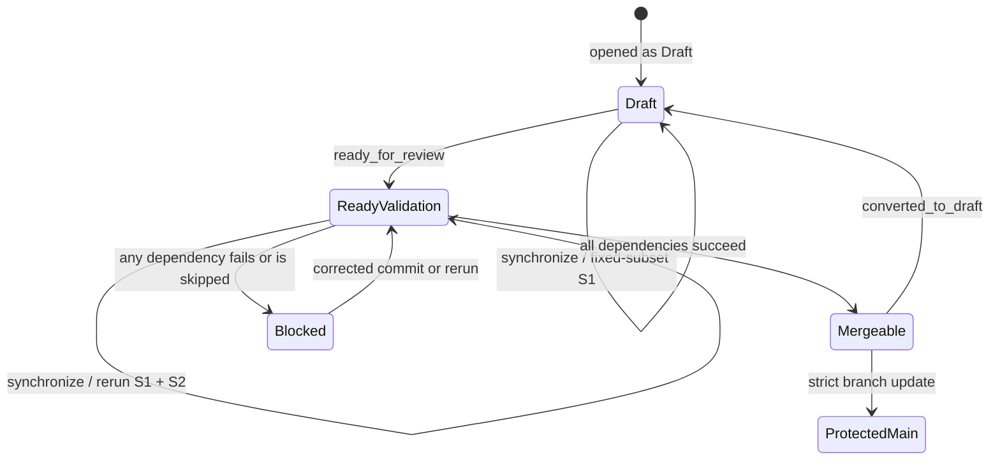

# Validation stages

Status: staged migration in progress, tracked by
[issue #12](https://github.com/BaoBao1996121/agent-flow-visualizer/issues/12).
This document is the normative contract for validation depth. Dated measurements
belong in [VERIFICATION.md](VERIFICATION.md).

## Goal contract

**Goal:** reduce time to the first actionable signal and CI runner cost so visual
and interaction ideas can be explored vertically, while preserving complete S2
on the current PR candidate against the latest protected base, followed by full
validation of the resulting protected-main commit. S4 separately validates the
exact release commit.

**Primary users:** maintainers exploring the observatory and contributors changing
adapters, projections, frontend behavior, or documentation.

**Non-negotiables:**

- protected `main` never accepts an unvalidated candidate commit;
- exploration evidence never masquerades as merge or release evidence;
- visual goldens are reviewed artifacts and are never auto-promoted;
- unknown impact escalates to the safer stage;
- failed first attempts remain visible even when a retry succeeds;
- repository-owned rules, not generated code or model output, select validation.

**Done for the first migration:** a measured S0/S1 loop, an enforced aggregate
gate, a proven Draft-to-Ready transition, historical-regression replay, and a
verified rollback path all exist while S2 remains mandatory before merge.

**Rollback:** pause merging whenever a required context can be skipped, duplicated,
or satisfied without its expected evidence.

## Current decision

The migration started shadow-first and has promoted the aggregate as a tenth required
context. This remains deliberately incremental because
GitHub accepts `success`, `skipped`, and `neutral` as successful required-check
conclusions. A required workflow skipped by workflow-level filters can instead
remain pending. The aggregate therefore starts on every relevant workflow run,
uses `always()`, and fails explicitly while a pull request is Draft. See GitHub's
[required-check troubleshooting](https://docs.github.com/en/pull-requests/collaborating-with-pull-requests/collaborating-on-repositories-with-code-quality-features/troubleshooting-required-status-checks)
and [job-condition documentation](https://docs.github.com/en/actions/how-tos/write-workflows/choose-when-workflows-run/control-jobs-with-conditions).

| Approach | Benefit | Cost / failure mode | Decision |
|---|---|---|---|
| Shadow fast gate while all existing jobs run | Safest way to measure signal quality | Temporarily adds runner work | Phase A complete |
| Draft runs S1; Ready runs S2 behind one aggregate | Fast repeated exploration without weakening merge evidence | Requires proven event transitions and aggregate semantics | Phase B in progress; hosted child-skip canary pending |
| Separate integration branch | Batches full regression | Adds drift, merge risk, and contributor complexity | Rejected for the current repository |

Merge queue is not the current mechanism. The repository is owned by a personal
account; organization ownership should be reconsidered before adopting that path.

## Stage contract

| Stage | Trigger and purpose | Required evidence | Blocking boundary | Status on 2026-07-18 |
|---|---|---|---|---|
| S0 — exploration | Local/on-demand loop while shaping one idea | Syntax/schema plus changed-module tests and one deterministic vertical smoke | Developer feedback only | Planned; no canonical runner or manifest yet |
| S1 — PR fast | Every PR commit; reject obvious cross-layer regressions quickly | Integrity/version contracts, affected contracts, bounded observatory smoke, stage manifest | Enforced transitively by the required aggregate | Fixed conservative subset implemented; observed at 13–18s across three hosted runs; impact selection and manifest pending |
| S2 — protected merge | Ready PR and protected-main candidate | Python 3.11–3.13, LangGraph floor/supported, frontend, full Chromium, pinned visual compare, container, S1 | Must pass on the current PR candidate against the latest protected base; the resulting main commit reruns S2 | Aggregate is the tenth required context; Draft child suppression is implemented and awaiting hosted canary; original nine remain required |
| S3 — deep | Scheduled/manual breadth and repetition | Repeat/order isolation, long-run and burst cases, optional browser/device/security matrices, owned quarantines | Does not block ordinary edits; failures block affected promotion until classified | Planned |
| S4 — release | Exact release candidate/tag | Complete S2 plus provenance, asset, compatibility, benchmark, and reproducibility checks | Blocks release | Planned; no stale nightly may substitute |

The current fixed-subset S1 runs Ruff over the repository, five focused Python
contract files, and syntax checks for the four primary frontend modules. It is
enforced transitively by the required aggregate, but is not yet the final
change-impact runner.

## Draft-to-Ready state machine

Phase A ran S2 in Draft and proved the aggregate's explicit failure, Ready success,
and resulting-main success before adding the aggregate as the tenth required
context. Phase B suppresses the six S2 job definitions only in Draft; its hosted
canary remains required before promotion. `opened`, `synchronize`, `reopened`,
`ready_for_review`, and `converted_to_draft` are explicit workflow activities so
the same PR candidate cannot inherit stale Draft state.

## Safety invariants

1. The aggregate has `if: always()` and an exact dependency list. It succeeds only
   when every expected dependency reports `success`.
2. Draft is an explicit aggregate failure, never a skipped or neutral merge gate.
3. CI/workflow, dependency, lock, container, browser-harness, golden-image, and
   unknown-impact changes escalate to S2 even after Draft optimization lands.
4. A stage manifest must eventually record commit/base, selected rules, commands,
   durations, attempts, results, skipped checks, and reasons. Until that exists,
   no claim of impact-map completeness is allowed.
5. A retry appends evidence; it does not replace or hide the first result.
6. Quarantine requires a linked issue, owner, reason, expiry, and visible
   non-blocking status.
7. Golden updates require human review and a clean pinned-Linux comparison with
   update mode disabled.
8. Failure artifacts can contain traces, DOM, requests, or screenshots and follow
   the repository privacy rules.

## Falsifiable hypotheses

| Hypothesis | Supporting observation | Refuting evidence | Validator |
|---|---|---|---|
| H1: a bounded S1 emits an actionable result earlier and uses less executor time than S2 | S1 completion precedes the first useful S2 result and remains below its runner cost | S1 is not earlier, is flaky, or approaches S2 cost | Actions timestamps, job durations, first-failure classification |
| H2: repository-owned impact rules can retain assigned regression detection | Historical and held-out failures are selected and caught by their assigned minimum stage | Any assigned regression escapes or an unknown path is downgraded | Path census, historical replay, mutation/held-out cases |
| H3: Draft-to-Ready gating preserves candidate and resulting-main protection | Draft is non-mergeable; Ready/new candidate reruns complete S2; aggregate passes only after all children; the resulting main commit reruns | Any Draft is mergeable, aggregate passes with a missing/skipped child, or resulting main lacks full S2 | Real shadow PR transitions, protected-main run, and branch-protection API readback |
| H4: staged validation improves sustained visual exploration | More vertical candidates are evaluated per runner-hour without higher escaped-defect count | Throughput is flat, false negatives rise, or maintainer overhead dominates | Four-week before/after window with sample counts and escaped-defect log |

## Measurements and initial gates

Every report includes its observation window, sample count, event/branch family,
and missing data. With fewer than 20 comparable runs, report median and range;
do not label the sample maximum a stable p95 or SLA.

| Metric | Definition | Initial decision use |
|---|---|---|
| Queue time | workflow creation to first job start | Diagnose platform delay separately from test work |
| Stage wall time | first stage job start to terminal stage result | Compare feedback latency |
| First actionable failure | workflow creation to the first correctly classified failing signal | Ensure the fast lane actually helps debugging |
| Runner minutes | sum of executor durations, not workflow wall time | Track cost under parallel jobs |
| First-attempt / retry / flake rate | original result retained and classified before retries | Prevent retries from manufacturing reliability |
| Escaped defect | regression assigned to an earlier stage but first detected later | Hard false-negative signal |
| Replay accuracy | known regression cases selected and caught at their assigned minimum stage | Gate impact-map promotion |

The initial baseline is small and correlated: seven successful PR runs across
three branch families had time-to-first-completed-job median 13 seconds and
observed range up to 25 seconds; total wall median was 81 seconds and summed
executor median was 4.33 runner-minutes. These are baseline observations from
the Actions API, not stable p95 values. The current provisional S0 target of 30
seconds is an initial product hypothesis for a short local attention loop, not a
measured human threshold. Draft S1 targets of 45 seconds and 1.5 runner-minutes
demand approximately 44% less wall time and 65% less executor time than the
81-second / 4.33-runner-minute baseline. Shadow data must recalibrate all three.

Historical replay begins with run `29570924390` (deep-NDJSON error classification)
and run `29638437349` (visual job host/container pip-cache path mismatch). The
first should be assigned to Python/adapter S1; workflow/visual-harness changes
that could recreate the second must escalate to S2.

## Migration and rollback

Migration order and status:

1. **COMPLETE:** run the fast and aggregate jobs in shadow while retaining the
   existing required contexts.
2. **PARTIAL:** prove Draft failure, Draft-to-Ready success, and resulting-main
   success. Converted-to-Draft, dependency skip/cancel, first/last matrix-member
   failures, and retry behavior remain canaries.
3. **COMPLETE:** after protected-main run 29645305313, add the aggregate as a
   tenth required context and read strict/admin/app bindings back from the API.
4. **IN PROGRESS:** suppress S2 children only in Draft; the required aggregate
   remains explicitly failing there. Hosted Draft/Ready/main evidence is pending.
5. **PENDING:** only after a stable observation window may protection be
   simplified from child contexts to the fast gate plus aggregate.

Current rollback baseline:

- `python (3.11)`, `python (3.12)`, `python (3.13)`;
- `LangGraph StreamPart v2 (1.1.0 floor)` and
  `LangGraph StreamPart v2 (supported 1.x)`;
- `frontend`;
- `Chromium observatory contract`;
- `container`;
- `Pinned Chromium visual regression`.

Rollback order is intentionally asymmetric: pause merges; restore these nine
required contexts; restore their execution on every PR commit; push a new commit
and verify all contexts plus strict/admin protection through the API; only then
remove the aggregate. This prevents a protection gap between old and new gates.

## Known limits and cost

- The current hosted S2 is already fast in wall-clock terms; the primary expected
  win is lower runner consumption across repeated Draft pushes and enough capacity
  for future renderer/browser/performance matrices.
- Phase A temporarily added one small runner job plus the aggregate to every run.
  Phase B is expected to remove complete-S2 runner work from repeated Draft pushes;
  its actual savings remain unmeasured until the hosted canary completes.
- The workstation has no Docker CLI, so local execution cannot claim complete S2.
- Three hosted fast-gate samples are insufficient for p95/flake claims. Impact
  selection, machine-readable manifests, vertical browser smoke, failure canaries,
  nightly breadth, and release-specific S4 remain pending.
