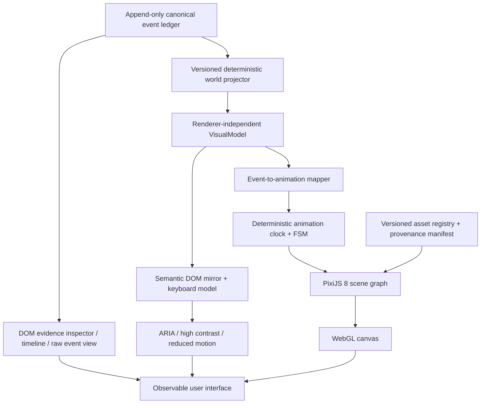
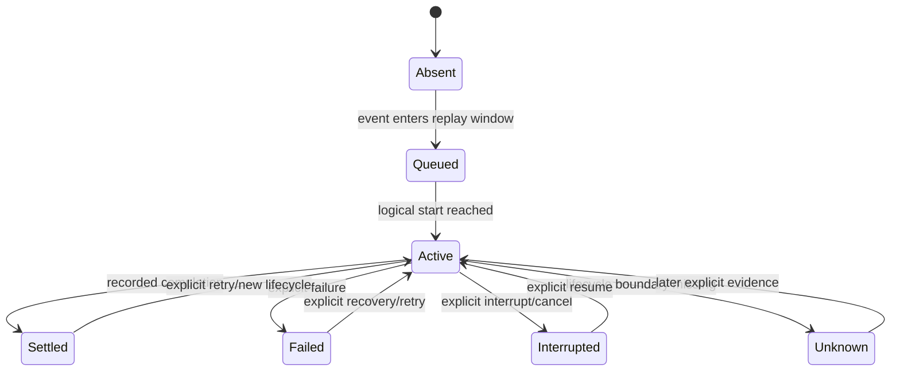

# Visual system architecture and renderer decision

Status: proposed staged migration
Decision date: 2026-07-17
Decision owner: Agent Anthill maintainers
Primary recommendation: **PixiJS 8 with the WebGL renderer**
Required benchmark peer: **Phaser 4.2.1**

Evidence freshness: official product, license, and pricing sources were retrieved
on 2026-07-17. Unless a threshold is explicitly required by an external standard,
every numeric threshold in this proposal is an initial configurable governance or
engineering gate, not a measured truth. Phase 0 must calibrate product and
performance gates; Phase 3 must calibrate renderer-comparison gates. Every change
to a gate must be recorded in the benchmark decision log before it is applied.

## Product position

Agent Anthill is an evidence-linked observatory for Agent systems. It is not a
game, workflow editor, animated log viewer, or decorative dashboard.

The visual system exists to reduce **Time to Correct Mental Model**:

- reveal what actually ran and in which authoritative ingest order;
- distinguish observed, declared, inferred, counterfactually verified, and
  unknown information;
- make context, memory, compaction, checkpoints, tools, collaboration, errors,
  usage, and explicit causality inspectable at several levels of detail;
- preserve a reversible path from every semantic visual object to its canonical
  event, source reference, evidence level, and ledger hash;
- make a live run and a historical replay visually equivalent at the same
  reducer version and timeline cursor.

The renderer is a projection client. It never becomes a second source of truth,
changes canonical state, infers missing events, or converts animation order into
causality.

### Success criteria

The new visual system succeeds only if it:

1. preserves semantic and evidence parity with the canonical world projection;
2. improves comprehension in a measured task, not merely screenshot quality;
3. remains deterministic under replay, seek, fork, and run comparison;
4. supports keyboard, screen-reader, high-contrast, and reduced-motion paths;
5. meets the performance budgets in this document on reference and low-end
   hardware;
6. keeps every shipped asset attributable and license-auditable;
7. remains replaceable behind a renderer-independent visual model.

### Non-goals

- Rebuilding Agent Anthill as a game engine project.
- Simulating work for which the ledger contains no evidence.
- Showing private chain-of-thought.
- Adding physics, particle effects, or skeletal animation without an
  observability use case.
- Copying the visual identity, characters, tiles, or effects of an existing
  commercial game.
- Using AI-generated art as proof of ownership, originality, or production
  readiness.

## Phase -1: correct the current visual semantics first

A 2026-07-17 browser audit found that the current Canvas implementation can
mislead a monitoring user even when the underlying ledger is correct. These
issues precede engine migration because a faster renderer would only reproduce
the same ambiguity more smoothly.

Blocking corrections:

1. **Split overloaded live states.** Replace `HEAD / LIVE` with a cursor phrase
   such as `AT HEAD · FOLLOWING`; call unfinished entities `OPEN` or
   `UNRESOLVED`; reserve `LEDGER CONNECTED` for transport health. A completed
   run freezes decorative motion while still showing unresolved lifecycles.
2. **Reconcile every projection.** Meter Room must read recorded measurements;
   Context must distinguish a state snapshot from an unobserved token budget;
   Compare must show message chunks separately from completed model calls.
   Missing lifecycle evidence is `not observed`, never a generic numeric zero.
3. **Prioritize signal over architecture wallpaper.** Active, open, failed, and
   unknown chambers receive the visual area and contrast. Inactive chambers
   collapse or recede while their existence remains discoverable.
4. **Make causality one action away.** The timeline cursor selects its current
   event by default. Opening Causal immediately shows its explicit links or an
   explanation that the event has zero explicit links.
5. **Separate color vocabularies.** Truth class uses outline/texture/icon first;
   domain, health, and compare-side color are secondary and must not reuse color
   as the only discriminator.
6. **Repair readable and accessible interaction.** Core labels use an initial
   minimum of 12 CSS pixels pending user testing. Normal text has at least 4.5:1
   contrast as a WCAG 2.2 AA floor; calibration and user testing may raise the
   font-size or contrast requirement but may never lower that external-standard
   floor. Tabs expose their ARIA state; important status changes have a bounded
   live region; Canvas hotspots have a keyboard-equivalent DOM path.
7. **Implement complete reduced motion.** Stop ambient loops, pulses, packets,
   scanlines, camera travel, and non-essential ticker work—not only entity bob.
8. **Disambiguate run identity.** Run and Compare selectors include source,
   status, timestamp, and a short stable ID rather than title alone.

Implementation status (2026-07-18):

| Correction | Status | Current evidence / remaining boundary |
|---|---|---|
| 1. Split overloaded live states | Complete | Browser contracts separate ledger HEAD, follow/pause, transport connection, terminal state, and unresolved work. |
| 2. Reconcile every projection | Complete | Missing cognition remains `NOT OBSERVED`; Memory exposes only recorded operations with evidence routes; Meter consumes owner-aware safe aggregates and exposes ambiguity, derivation, pricing basis, and estimated status; Compare separates message chunks from completed calls and compares measurements only when unit, scope, aggregation, and cost semantics are compatible. |
| 3. Prioritize signal over wallpaper | Complete | Inactive/no-signal chambers recede through explicit `NO SIGNAL AT CURSOR` treatment. A deterministic Canvas cap retains selected, failed, and unknown entities before ordinary activity, and Meter shows only safe signal. This is an implementation contract, not measured comprehension evidence. |
| 4. Make causality one action away | Complete | Timeline selection is the default causal root and an open panel follows seek. |
| 5. Separate color vocabularies | Complete | Event evidence is printed as text and reinforced by outline/pattern; Compare prints `ON` only for explicit `true`, `OFF` only for explicit `false`, and `NOT OBSERVED` for `null`; causal direction exposes `aria-pressed`; Compare availability/comparability is textual. Unsafe measurement identities neutralize control and bidi characters before display. Browser contracts do not rely on color alone. |
| 6. Repair accessible interaction | Complete | Main Canvas chamber labels are 12 px; tested core DOM labels are at least 12 CSS px and tested normal-text pairs meet 4.5:1. Tabs, bounded status announcements, keyboard evidence routes, and a complete per-cursor semantic object mirror have browser regressions. Canvas micro-labels at 8–11 px are supporting glyphs with 12 px DOM equivalents, not a claim that every decorative Canvas glyph is 12 px. Real assistive-technology and user testing remain pending. |
| 7. Implement complete reduced motion | Complete | OS preference, application `system`/`reduce`/`full` override, terminal worlds, and static capture all stop Canvas RAF work and CSS ambience; changing the application override takes effect without reload. |
| 8. Disambiguate run identity | Complete | Run and Compare selectors share title, first-event `SRC`, ledger-HEAD status, first-event UTC `INGEST`, collision-aware ID, and explicit synthetic `[DEMO]`. |

Identity labels keep absent or invalid facts `UNKNOWN`. Selector status describes
ledger HEAD, while the world and Compare cards retain their historical
cursor/progress projection. Main titles and Compare cards use the same
control/bidi/delimiter neutralization. Request epochs, abortable Compare work,
both-side runtime-event refresh, stale identity markers, and atomic
run-selection rollback have browser regressions. All eight implementation
corrections now have ordinary Chromium contracts. This does not prove that the
visual hierarchy improves comprehension for real users, that every assistive
technology works, or that a future renderer preserves the same semantics; those
remain measured Phase 0 and renderer-parity obligations.

Phase -1 is not yet a release-complete visual gate. Run 29638608292 generated
four pinned-Linux candidates; each image was reviewed, accepted, and added to the
current promotion change. The job is now configured as a required comparison
with update mode disabled. The remaining gate is its first hosted pass against
the committed PNGs without rewriting them. See
[VISUAL_BASELINES.md](VISUAL_BASELINES.md). The 49 ordinary browser contracts and
their two-repeat run protect semantic behavior in the meantime, but they are not
pixel-regression protection. These same semantic assertions become
renderer-parity tests for PixiJS and Phaser.

## Phase 0 art-direction spike and Phase 2 representative slice

Renderer choice alone cannot make the product beautiful or comprehensible. Before
Phase 2 implementation, Phase 0 must compare two or three representative visual
directions using the same canonical fixture and information obligations. Each
direction must contain production-representative rather than decorative content:

- one real chamber at realistic information density;
- one readable Agent character with at least idle, inspect, tool-use, and explicit
  error poses or frames;
- one explicit tool request/response flow and one persistent incident state;
- the proposed camera or orthographic grid, spatial hierarchy, typography,
  palette, lighting, outline, icon, and texture rules;
- four screenshot sets: normal, high-contrast, color-vision-safe, and reduced-motion
  static presentation.

All directions consume the same recorded events and expose the same evidence route.
AI material remains subject to the asset rules below and cannot enter this slice as
an unreviewed production asset.

Phase 0 must preregister and baseline three art-direction gates:

1. **Comprehension:** timed Time to Correct Mental Model tasks plus wrong-inference
   count for observed, inferred, unknown, failed, and disconnected states.
2. **Information density:** the number of active, open, failed, and unknown objects
   that remain discoverable and correctly understood in the reference viewport,
   including the cost of labels and evidence routes.
3. **Recognition:** accuracy for Agent identity, chamber, lifecycle state, truth
   class, selected causality, and transport health without relying on color alone.

Numeric acceptance values are not invented in this document. Phase 0 measures the
current Canvas baseline, records the fixture and protocol, then freezes initial
configurable gates in the decision log. Screenshot preference alone cannot select a
direction. A candidate must preserve semantic, keyboard, high-contrast, and
reduced-motion parity and must meet the frozen comprehension, density, and
recognition gates.

Phase 2 must use the selected direction and a production-representative atlas for
its PixiJS slice. The same atlas, typography, viewport, and fixture are mandatory in
the Phaser benchmark; a placeholder-art benchmark cannot decide the production
renderer.

## Renderer decision

### Recommendation: PixiJS 8

PixiJS 8 is the recommended web-native renderer because its abstraction level
matches the product:

- retained-mode 2D scene graph without imposing a game loop architecture on the
  event model;
- WebGL/WebGL2 production path and an optional WebGPU path for experiments;
- containers, render layers, texture atlases, filters, masks, interaction,
  culling, and cache-as-texture primitives;
- a controllable ticker that can be replaced by Anthill's deterministic replay
  clock;
- modular imports and a smaller conceptual surface than a complete game engine;
- optional DOM accessibility overlays that can complement, but not replace, the
  semantic DOM inspector;
- MIT license.

The first production implementation must explicitly select PixiJS's WebGL
renderer. PixiJS currently describes WebGL as the recommended stable renderer
and WebGPU as still subject to browser inconsistencies. WebGPU may be an
experimental preference after feature-parity and browser-matrix tests pass.

Pin an exact tested PixiJS `8.x` version in the lockfile. “PixiJS 8” is the
compatibility family, not permission for unreviewed floating upgrades.

### Required benchmark: Phaser 4.2.1

Phaser 4.2.1 must implement the same bounded benchmark scene before the full
PixiJS migration is approved. Phaser is a credible peer because it supplies:

- a modern WebGL renderer and render-node architecture;
- scene, camera, input, tween, animation, tilemap, particle, and asset systems;
- the long-running Phaser project's browser tooling and large web-game ecosystem;
- TypeScript declarations and an MIT license.

Those strengths may also be unnecessary weight. Agent Anthill already owns its
event store, reducer, timeline, inspector, replay semantics, and interaction
model. Phaser must not win because a demo is faster to animate; it must win on
measured runtime or whole-project delivery cost while preserving the same truth
contract.

Phaser remains a benchmark dependency or isolated branch unless the adoption
conditions in this document are met.

The benchmark must install exactly `phaser@4.2.1` with no caret, tilde, tag, or
floating range. Its committed lockfile and benchmark manifest must record the
resolved package URL and package-manager integrity digest. A different resolved
artifact is a different benchmark and requires a new decision-log entry before its
results may be compared.

The Phaser project is mature, but its version 4 renderer is not: Phaser 4.0.0 was
released on 2026-04-10 and 4.2.1 on 2026-07-09. The older ecosystem does not prove
v4 renderer stability, accessibility parity, or browser compatibility. Those are
explicitly pending the Phase 3 benchmark and browser matrix.

### Boundary comparisons

| Candidate | Useful boundary | Why it is not the default |
|---|---|---|
| PixiJS 8 | Web-native retained 2D rendering | Recommended default; still requires Anthill-owned state, accessibility, LOD, and deterministic animation layers |
| Phaser 4.2.1 | Full web 2D game framework and same-scene benchmark | More lifecycle, scene, camera, physics, and game abstractions than the observatory currently needs |
| Godot | Standalone/native application, rich editor, complex game-like interaction | Web export adds WebAssembly/WebGL2 payload and JavaScript integration boundaries; web capabilities and performance differ from native exports |
| Blender | Optional offline low-poly modelling, rigging, pose normalization, and orthographic frame rendering | Authoring tool only; `.blend`, Blender Python, geometry, armatures, and Blender runtime code never enter the browser bundle |
| Rive | A small number of polished vector micro-interactions or brand animations | Its state machine is designer-authored and advanced at runtime; it must not own Agent truth, world layout, or replay state. Web runtimes add WASM and exported `.riv` assets |
| Spine | High-quality skeletal character animation | Commercial editor/runtime license obligations and a specialized skeletal workflow are disproportionate to the current information-design need |
| Pixelorama | Pixel cleanup, palette alignment, spritesheet/PNG export, and asset metadata preparation | Offline MIT authoring/export tool only; it is not a runtime renderer |

Godot, Rive, and Spine are architecture boundaries, not candidates in the first
renderer benchmark. Reconsidering one requires the explicit triggers in
“Failure and exit conditions.”

## Truth-before-theatre visual grammar

Visual richness is allowed only after the evidence grammar remains readable in
a paused frame, a reduced-motion frame, and a monochrome or color-deficient
view.

| Truth class | Required grammar | Motion rule | Forbidden implication |
|---|---|---|---|
| `observed` | Solid outline, full-opacity body, recorded-source badge | Direct, restrained transition tied to the event cursor | Complete instrumentation of the domain |
| `declared` | Double or blueprint-style outline, declaration badge | Construction/reveal rather than execution motion | Proof that the declared path executed |
| `inferred` | Dashed outline, confidence label, interpretation badge | Soft pulse or short dissolve; never stronger than observed | Certainty or direct runtime observation |
| `counterfactual_verified` | Split/intervention marker plus linked rerun evidence | Two-track transition showing intervention and result | Universal causality beyond the recorded intervention |
| unknown / outside contract | Fog, hatch, empty socket, or explicit `UNKNOWN` label | Static by default | Absence of the underlying operation |
| observable but not seen | Muted instrumented outline plus `NO SIGNAL AT CURSOR` | No activity animation | Proof that the operation did not happen |

Additional invariants:

- Color is redundant information. Shape, outline, label, texture, or icon must
  encode the same distinction.
- A visual edge is causal only when backed by `causation_id`, span parentage, or
  an explicit canonical link. Timeline adjacency may use a neutral sequence
  rail, never an arrow that reads as causality.
- `complete` means a capture ended. It does not mean success unless the source
  explicitly supplies an outcome.
- Active animation means “this recorded transition is being presented at the
  current cursor,” not “the external system is definitely still executing.”
- Unknown event families remain visible in Unknown Fog until a versioned
  projector understands them.
- Decorative ambience must not compete with active evidence, alerts, selected
  causality, or focus indicators.

## Layered architecture



### Layer responsibilities

1. **Ledger:** authoritative immutable events, ordering, clocks, evidence, links,
   privacy, and hashes.
2. **World projector:** pure reducer that reconstructs semantic state for one
   reducer version and cursor.
3. **VisualModel:** renderer-independent entities, zones, lanes, semantic edges,
   selection, visibility, truth grammar, and LOD eligibility.
4. **Animation mapper:** converts a canonical transition into one or more
   versioned animation intents. It cannot inspect unrelated future events.
5. **Animation FSM and clock:** computes exact presentation state for a logical
   replay position.
6. **Renderer adapter:** creates, updates, pools, culls, and destroys PixiJS
   objects. It contains no domain inference.
7. **DOM inspector and semantic mirror:** provides accessible interaction,
   evidence drill-down, text alternatives, and a non-canvas fallback.
8. **Asset registry:** resolves only approved, hashed, provenance-recorded
   assets.

The existing Canvas renderer remains behind the same `VisualModel` contract
during migration. This is the rollback path and the oracle for semantic parity,
not permanent duplicate product logic.

### Runtime failure and truth-preserving degradation

Renderer health, capture transport health, canonical ledger health, and the
external Agent run state are four separate signals. A presentation failure may
reduce visual richness but may never rewrite, discard, fabricate, or relabel
canonical evidence.

| Failure | Required degradation | User-visible state | Required verification |
|---|---|---|---|
| WebGL is unavailable or PixiJS initialization fails | Keep ledger ingest, timeline, filters, and evidence inspector active. Start the existing Canvas adapter when it passes its own capability check; otherwise use the searchable semantic DOM and static chamber map. | `RENDERER DEGRADED` names the failed renderer and active fallback without changing run status. | WebGL-disabled and initialization-exception browser tests; semantic snapshot parity in each fallback |
| WebGL context loss or failed restoration | Stop only Pixi presentation work. Continue ledger ingest and preserve the selected logical cursor. On successful restoration, destroy stale GPU objects and reconstruct from `VisualModel`, asset hashes, and the same cursor; never replay mutation callbacks. Fall back if restoration fails. | `WEBGL CONTEXT LOST` followed by `RESTORING` or `RENDERER DEGRADED`; no activity animation implies that the external run paused. | Synthetic `webglcontextlost` / `webglcontextrestored` tests, visual-state hash before/after restoration, repeated-loss leak test |
| Atlas or manifest is missing; an asset hash differs; fetch times out; image/atlas decoding fails | Reject the untrusted or unreadable asset. Render a versioned semantic placeholder with label, truth class, bounds, and evidence route. Never fetch an unregistered remote substitute. Other approved assets may continue. | Persistent `ASSET INVALID` incident with asset ID and privacy-safe diagnostic; affected semantics remain inspectable. | Missing-file, manifest-schema, wrong-hash, timeout, partial-response, malformed-image, and decode-error fixtures |
| GPU-memory pressure, allocation failure, or context instability near the memory gate | In order: stop decorative effects, release caches, lower texture/atlas resolution where readability survives, reduce canvas LOD, and switch to the Canvas or DOM fallback. Ledger events, selected objects, alerts, unknowns, and semantic DOM entries are never dropped. | `VISUAL CAPACITY REDUCED` reports the active LOD/fallback and keeps memory pressure distinct from run health. | Constrained-memory profile, allocation-failure injection, cache-release assertion, selected/alert/unknown survival test |
| Ledger transport disconnects or reconnects with a burst | Label capture transport as disconnected while preserving the last verified cursor and hash. Reconnect from the last acknowledged source cursor, validate and deduplicate in canonical ingest order, then catch presentation up to head. If the source cannot backfill a gap, preserve an explicit capture-gap/unknown interval. | `CAPTURE DISCONNECTED`, `RECONNECTING`, then `CATCHING UP`; never `RUN FAILED` unless the source explicitly reports failure. | Disconnect during activity, duplicate/out-of-order reconnect batch, backfill success, unrecoverable-gap, and delayed-replay tests |
| Renderer update, ticker, accessibility overlay, or event-to-animation code throws | A renderer error boundary stops the failing loop, records a privacy-safe diagnostic, destroys owned listeners/tickers where possible, and activates Canvas or semantic-DOM fallback. Ledger ingest and inspection continue. Restart reconstructs from the immutable ledger and current cursor. | `RENDERER CRASHED` plus fallback identity and retry action; no blank observatory and no synthesized terminal event. | Exception injection at create/update/destroy/ticker/overlay stages, listener cleanup, deterministic restart, and repeated-crash circuit-breaker test |
| Visual schema, animation schema, or renderer version is incompatible | Refuse approximate rendering. Keep raw evidence and known fields in the DOM inspector and place unsupported objects in labelled Unknown Fog until a compatible projector/renderer is loaded. | `VISUAL VERSION INCOMPATIBLE` names the supported and observed versions. | Forward-version fixture, downgrade fixture, unknown-field preservation, and rollback test |

Browser GPU-memory pressure is not uniformly observable. Runtime degradation may
use only available estimates, allocation/context failures, or configured
object/texture guards. Diagnostics and UI must label an estimate or inference as
such; they may say `GPU MEMORY PRESSURE` without qualification only when the
browser/tooling supplies a direct supported signal.

Retry count, backoff, timeout, restoration window, and crash circuit-breaker values
are initial configurable operational gates. Phase 0 must freeze them from failure
injection results and record later changes in the decision log. Retries are bounded;
exhaustion always produces an explicit stable fallback rather than an infinite loop
or silent blank canvas.

Every degradation path emits privacy-safe renderer/capture diagnostics with run ID,
cursor, renderer and schema versions, asset IDs or hashes where relevant, fallback,
and reason code. Diagnostics must not include raw prompts, model content, tool
secrets, or inaccessible asset-review records.

## Event-to-deterministic-animation state machine

### Logical animation time

Animation state must be a pure function:

```text
visual_state = render(
  reducer_version,
  visual_schema_version,
  animation_schema_version,
  run_id,
  ingest_seq,
  logical_substep,
  accessibility_preferences
)
```

Wall-clock time may advance the live cursor, but it must not be accumulated into
authoritative sprite state. If the browser drops frames, the next frame samples
the correct logical position; it does not replay missed mutations.

Every animation uses:

- a stable intent ID derived from event ID, visual role, and animation-schema
  version;
- an explicit start cursor and logical duration;
- a deterministic easing identifier;
- a start and end state;
- a semantic priority;
- a persistence rule;
- a reduced-motion replacement;
- an optional seed derived from the event ID for decorative variation.

`Math.random()`, frame-count accumulation, and completion callbacks that mutate
domain state are prohibited.

### Common FSM



The FSM is presentation state, not a replacement for canonical event types.
Seeking backwards reconstructs it from the event prefix. No reverse-animation
callback edits the world.

### Initial mapping

| Canonical transition | Deterministic visual intent |
|---|---|
| `run.started` | Activate Control Nest run marker |
| `agent.step.started` | Place or activate an agent in its semantic lane |
| `model.request.started` | Move a bounded request token into Model Engine |
| `model.response.chunk` | Update one aggregated stream indicator; do not spawn one permanent sprite per token |
| `tool.execution.started` | Activate a tool bay and explicit request edge |
| `tool.execution.failed` | Transition the same lifecycle object to failed and link Incident Bay |
| `context.item.added` | Add a keyed context tile; preserve source/evidence drill-down |
| `context.compaction.started` | Move only explicitly linked context items into Compaction Plant |
| `compaction.completed` | Show kept/replaced/removed lineage from canonical links |
| `memory.read` / `memory.write` | Animate the recorded direction and memory layer |
| `handoff.proposed` | Draw a pending bridge using the explicit sender/recipient identities |
| `handoff.completed` | Transfer ownership only after explicit acceptance/completion evidence |
| `checkpoint.created` | Stamp a stable checkpoint marker with parent lineage |
| `error.raised` | Create a persistent incident marker until explicit recovery |
| `run.completed` | Settle capture activity; show outcome only when explicitly supplied |
| unmapped extension | Add a labelled Unknown Fog signal with a raw-event route |

Concurrent operations occupy deterministic lanes sorted by explicit parent,
source sequence, then event ID. Their screen order must not imply execution
serialization.

## Semantic zoom and level of detail

LOD is information selection, not merely sprite scaling.

| Level | User question | Visible content | Initial activation rule |
|---|---|---|---|
| L0 — World | Where is activity, pressure, failure, or uncertainty? | Chambers, aggregate flows, run status, alert markers, unknown fog | Fit-to-world or zoom `<0.55` |
| L1 — Stage | Which Agent stage or subsystem is active? | Agent lanes, grouped steps, model/tool/context/memory/checkpoint summaries | Zoom `0.55–1.19` |
| L2 — Operation | What exact operation and lifecycle occurred? | Individual tasks, calls, state changes, explicit causal edges, measurements | Zoom `1.20–2.39` or selected stage |
| L3 — Evidence | What proves this object? | Canonical event, payload structure, evidence, source/span/artifact/hash links | Zoom `>=2.40` or explicit inspect action |

These zoom thresholds are initial configurable values, not measured truths.
Phase 0 must tune them through comprehension and performance tests.

LOD rules:

- selection and keyboard focus override automatic hiding;
- a hidden child contributes to a labelled aggregate, never disappears without
  accounting;
- active incidents, selected causality, and unknown signals survive one level
  farther out than routine objects;
- offscreen objects are culled;
- static chamber backgrounds may use `cacheAsTexture`;
- sprites use atlases and nearest-neighbour sampling where pixel art requires
  it;
- token/message chunks are windowed or aggregated before rendering;
- an initial configurable guard of more than 5,000 candidate visible objects
  triggers semantic clustering or a server-provided stage summary rather than
  unrestricted sprite creation; Phase 0 must tune this guard from comprehension,
  memory, and frame-time data;
- DOM evidence remains queryable even when its canvas representation is
  aggregated.

## Asset pipeline and provenance

### AI-generated visual material

Generative image tools may be used only for:

- visual exploration;
- composition and palette concepts;
- non-shipping mood boards;
- rough underlays that a human redraws and aligns to the project grid.

AI output must not be committed directly as a production sprite, tileset, logo,
or character. Before an AI-assisted asset can ship, a human must:

1. redraw or materially clean it on the approved pixel grid;
2. reduce it to the approved palette and contrast rules;
3. remove pseudo-detail, inconsistent lighting, broken silhouettes, accidental
   text, and visual noise;
4. verify similarity risk against known third-party brands and games;
5. confirm that the chosen provider terms allow the intended distribution;
6. record source, model/tool, transformation, reviewer, license assessment, and
   file hash;
7. test the asset at L0–L3 and in high-contrast/reduced-motion modes.

If provenance or distribution rights cannot be established, discard the asset.
“Generated by AI” is not a license.

### Optional Blender authoring stage

Blender may standardize reusable characters, machines, chambers, and props before
pixel cleanup when drawing every pose independently would create inconsistent
silhouettes, proportions, lighting, or camera angles.

```text
AI concept / component underlay
  → human-reviewed low-poly components in Blender
  → optional armature rig with versioned shared actions
  → fixed orthographic cameras, lighting, scale, and frame ranges
  → transparent orthographic PNG frame sequences
  → Pixelorama pixel cleanup, palette reduction, manual silhouette correction
  → reviewed spritesheet / atlas export
  → asset-provenance manifest and CI hash gate
```

The Blender stage is optional and offline:

- AI output remains a concept or underlay; a human owns topology, proportions,
  rigging, actions, camera framing, lighting, and final pixel decisions.
- Shared rigs and action names may normalize poses such as `idle`, `walk`,
  `inspect`, `handoff`, `tool-use`, `error`, and `recover`, but those actions do
  not define Agent runtime states. Canonical events still select visual intents.
- Orthographic cameras use pinned transforms and scale so every direction and
  animation can be regenerated without perspective drift.
- Background rendering should pin Blender version, render engine, resolution,
  frame range, camera, color-management settings, and output naming.
- Pixelorama remains the final authority for pixel-grid alignment, palette,
  contrast, outlines, frame cleanup, and atlas packing. Raw Blender renders are
  not production pixel assets.
- `.blend` sources, rigs, meshes, scripts, and intermediate renders stay in the
  authoring pipeline or source archive. The web application loads only approved
  2D PNG/WebP atlases and provenance metadata.
- Blender is not a browser dependency: do not ship a Blender WebAssembly build,
  embed a 3D viewport, or reproduce the Blender scene at runtime.
- Blender's software license does not establish rights to imported concepts,
  textures, models, fonts, or AI material. Record every input and derivative in
  the asset provenance manifest.

### Pixelorama role

Pixelorama is the recommended MIT-licensed offline tool for:

- pixel-grid cleanup;
- palette normalization;
- frame and layer review;
- spritesheet, PNG, animated PNG, or GIF export;
- optional command-line bulk export using a project-owned, version-pinned CLI
  and export recipe. Pixelorama does not guarantee byte-identical or pixel-identical
  output; export determinism remains pending verification in Phase 0.

Pixelorama project files are authoring sources. Runtime assets must be exported
to documented open formats and registered by hash.

### Asset provenance manifest

Every non-code visual asset must have an entry in
`static/assets/asset-provenance.json`. CI must fail when a shipped asset is
missing, its hash differs, or its approval is incomplete.

```json
{
  "manifest_version": "0.1.0",
  "assets": [
    {
      "asset_id": "anthill.agent.observer.idle.v1",
      "path": "static/assets/sprites/observer-idle.png",
      "sha256": "<lowercase-sha256>",
      "media_type": "image/png",
      "origin_type": "human_original",
      "author": "<name-or-project-handle>",
      "copyright_holder": "<person-or-entity>",
      "source_url": null,
      "source_asset_id": null,
      "source_hash": null,
      "source_archive_ref": null,
      "source_archive_access_tier": null,
      "source_archive_retention": null,
      "source_license": null,
      "project_license_grant_basis": "<signed-contribution-record-or-explicit-license>",
      "generator": null,
      "generator_version": null,
      "prompt_hash": null,
      "provider_terms_url": null,
      "provider_terms_retrieved_at": null,
      "provider_terms_snapshot_ref": null,
      "provider_terms_snapshot_hash": null,
      "provider_terms_snapshot_access_tier": null,
      "provider_terms_snapshot_retention": null,
      "private_review_record_id": null,
      "human_modifications": [
        "redrawn on 16x16 grid",
        "reduced to anthill-observability-v1 palette"
      ],
      "authoring_tool": "Pixelorama",
      "authoring_tool_version": "<version>",
      "export_preset": "pixel-nearest-png-v1",
      "license_review_status": "approved",
      "license_review_reviewer": "<reviewer>",
      "similarity_review_status": "approved",
      "similarity_review_method": "<documented-review-method>",
      "reviewer": "<reviewer>",
      "reviewed_at": "<RFC3339 timestamp>",
      "approval": "approved",
      "notes": "Original project asset; no third-party game asset used."
    }
  ]
}
```

Allowed `origin_type` values begin with:

- `human_original`;
- `code_generated`;
- `licensed_third_party`;
- `ai_concept_human_redraw`.

Raw AI prompts may contain confidential material and need not be committed. A
prompt hash plus a private review record is sufficient when the prompt itself
cannot be published. `private_review_record_id` must locate that access-controlled
record for an authorized reviewer; a bare hash without a review record is not
approval.

The manifest separates a source asset's license from the legal basis on which the
project distributes the transformed asset. A human-original asset normally has no
`source_license`; it still needs a copyright holder and an explicit project license
grant basis.

A non-null `source_hash` requires a `source_archive_ref` that an authorized
reviewer can resolve to the exact archived input. When a generator was involved,
provider terms require URL, retrieval time, `provider_terms_snapshot_ref`, and
`provider_terms_snapshot_hash`; a hash without a retrievable snapshot is not a
capture. References must be immutable or content-addressed and remain resolvable
under the recorded access tier.

Initial access-tier values are:

- `public`: the reference is readable in public CI;
- `repository`: the reference is readable in trusted repository CI;
- `maintainer_restricted`: only approved maintainers and audit jobs may read it;
- `legal_restricted`: only the named legal/provenance reviewers may read it.

`source_archive_retention` and `provider_terms_snapshot_retention` identify a
versioned retention policy and minimum retention date or event. Phase 0 must define
the policies, authorized roles, backup location, deletion approval, and audit
frequency. A referenced record cannot expire while a distributed asset still
depends on it unless maintainers complete a new rights review and replace the
distribution basis.

CI always validates manifest schema, approval-state consistency, and the shipped
asset's on-disk hash. CI may recompute a source or provider-terms snapshot hash only
when its reference resolves in the current job's access tier. For restricted
references, public CI validates the reference/hash/tier/retention tuple and the
presence of the required approval-record identifier; an authorized audit job or
named reviewer performs the content recheck. CI must report `not recomputed:
restricted` rather than claim a successful hash verification.

Neither CI nor a stored snapshot proves copyright ownership, originality, provider
terms, or similarity safety. A named human reviewer must approve those rights and
risks before the asset may ship.

## Accessibility and reduced motion

The canvas cannot be the only representation of important information.

The public observatory targets **WCAG 2.2 Level AA** for all monitoring,
replay, comparison, teaching, and evidence-inspection paths. This is an acceptance
target, not a blanket conformance claim: conformance is reported only after the
release candidate passes automated checks and the manual matrix below. The 4.5:1
normal-text contrast requirement is an external-standard floor. Product calibration
or user testing may increase contrast, size, spacing, or stroke weight but cannot
approve a value below that floor.

Minimum blocking assistive-technology matrix:

| Platform | Browser / assistive technology | Required coverage |
|---|---|---|
| Supported Windows release | Chromium and Firefox with current stable NVDA | Search virtualized objects; traverse, select, inspect, compare, seek, pause/resume, identify delayed replay, and recover from every renderer/capture degradation state |
| Supported macOS release | Safari with built-in VoiceOver | The same semantic object discovery, timeline, evidence, compare, pause/resume, delayed-replay, and degradation coverage |
| Keyboard-only browser matrix | Chromium, Firefox, and Safari without pointer input | All controls, canvas-equivalent object routes, visible focus, filters, raw evidence, static export, and escape from overlays |
| Magnification and system presentation | 200% browser zoom, platform high-contrast/increased-contrast settings, and application reduced motion | No loss of information, focus, labels, truth grammar, or access to offscreen/aggregated objects |

Every release artifact pins the exact OS, browser, and assistive-technology versions,
test fixtures, known failures, and reviewer. An automated scanner cannot substitute
for the NVDA, VoiceOver, keyboard, zoom, contrast, and reduced-motion passes. A
blocking failure cannot be waived merely because the Canvas picture remains visible;
the semantic DOM or another equivalent path must continue to work.

Required behavior:

- maintain a searchable, virtualized semantic DOM tree or list covering every
  discoverable `VisualModel` object, including routine and currently offscreen
  objects;
- let keyboard and assistive-technology users discover, focus, select, inspect,
  and navigate any mirrored object without first using a canvas hit target;
- keep timeline, inspector, filters, compare controls, and evidence navigation
  operable without pointer input;
- use PixiJS accessibility overlays only for canvas-local interactive objects;
  use ordinary DOM controls where possible;
- preserve visible focus and a deterministic keyboard order independent of
  sprite draw order;
- provide text alternatives containing entity, state, truth class, evidence
  count, and timeline cursor;
- never encode truth, failure, ownership, or causality by color alone;
- provide high-contrast and color-vision-safe palettes;
- provide Pause/Resume for automatic playback and live visual updates;
- expose a static snapshot/export suitable for teaching, documentation, and
  users who cannot consume motion;
- ensure no content flashes more than three times in any one-second period.

Pause affects presentation only. The ledger continues to ingest, validate, hash,
and persist incoming events while visual playback or live updates are paused.
Resuming a live monitoring view defaults to the current ledger head. A user may
instead resume the delayed cursor only after the interface explicitly labels it
`DELAYED REPLAY`, shows the distance from head, and offers a direct jump to head.
The renderer must never imply that pausing presentation paused the external run or
the evidence capture.

When `prefers-reduced-motion: reduce` is active, or the in-product setting is
enabled:

- replace travel, camera pan, parallax, bounce, shake, scaling, and particle
  motion with immediate placement, restrained opacity, outline, or label
  changes;
- stop ambient loops;
- present explicit causal transfer as a static highlighted edge plus source and
  destination state change;
- keep logical duration and replay cursor semantics unchanged;
- announce meaningful changes through the semantic DOM without flooding an
  `aria-live` region for every message token.

The user preference must be changeable without reload and must override the
operating-system default for this application only.

## Performance acceptance matrix

All budgets and stress counts below are initial configurable engineering gates
and must be calibrated in Phase 0, then replaced by published measurements.
Renderer-comparison percentages are calibrated in Phase 3. A threshold change
requires the fixture, raw results, rationale, approver, and date in the decision
log; an undocumented threshold change cannot make a release pass.

“Visible objects” means renderer objects after semantic LOD and culling, not total
ledger events.

| Profile | Dataset / view | Required target | Memory gate | Release role |
|---|---|---|---|---|
| Reference desktop: current Chromium, 1920×1080, 4+ modern cores, integrated GPU | 50,000 ledger events; 2,000 visible objects; 100 active intents | 60 FPS target; frame p95 `<=16.7 ms`, p99 `<=33.3 ms`; inspect response p95 `<=100 ms` | Renderer route JS heap + GPU estimate `<=250 MB` | Blocking |
| Low-end laptop: current Chromium, 1366×768, 4 cores, 8 GB RAM, integrated GPU | 50,000 ledger events; 1,000 visible objects; 50 active intents | At least 30 FPS; frame p95 `<=33.3 ms`, p99 `<=50 ms`; inspect response p95 `<=150 ms` | `<=220 MB` | Blocking |
| Firefox desktop | Same reference fixture at 1,000 visible objects | No semantic differences; at least 30 FPS; p95 `<=33.3 ms` | No unbounded growth over a 20-minute replay | Blocking |
| Safari desktop | Same reference fixture at 1,000 visible objects | No missing truth grammar or input path; at least 30 FPS | No unbounded growth over a 20-minute replay | Blocking before public renderer default |
| Mobile/tablet browser | 10,000 events; 500 visible objects; reduced effects | 30 FPS target; input p95 `<=150 ms` | `<=180 MB` | Non-blocking alpha, documented limit |
| Reduced-motion mode | 50,000 events; 2,000 visible objects | State changes remain complete; no continuous non-essential ticker work while paused | No higher than normal mode | Blocking |

Additional gates:

- the initial stress sequence is 100 run switches and 200 full timeline seeks;
  Phase 0 must tune the sequence length and fixture from measured allocation and
  lifecycle behavior;
- no renderer-object, texture, listener, ticker, or accessibility-overlay leak
  under the Phase 0 memory protocol described below;
- time-travel seek must produce the same visual snapshot hash for the same
  reducer, visual schema, cursor, viewport, and accessibility settings;
- live-event bursts may coalesce presentation frames but may not drop ledger
  events or change final state;
- the initial first-usable-local-render gate is two seconds on the reference
  machine after a warm server start;
- renderer and asset bundle deltas must be recorded in raw and gzip bytes;
- screenshot comparisons must test truth grammar at every LOD, not demand
  byte-identical antialiasing across GPU vendors.

Phase 0 must freeze the memory leak measurement protocol before any memory gate
becomes release-blocking. The protocol must specify: fixture and exact dependency,
browser, OS, and hardware versions; allocation/texture instrumentation; warm-up and
quiescence periods; forced-GC procedure where the browser exposes one and a timed
quiescence fallback where it does not; pre-test, steady-state, and post-test sample
windows; repeat count; allowed retained-memory delta and steady-state growth slope;
GPU estimate method and uncertainty; accessibility-overlay node count; and failure
diagnostics. Until those values are frozen and published, `no leak` and `no
unbounded growth` are hypotheses under test, not verified release claims.

### PixiJS versus Phaser benchmark

Both implementations must consume the same serialized `VisualModel`, animation
intents, atlas, viewport, deterministic clock, and fixture.

Record:

- exact dependency versions, resolved package URLs, integrity digests, and the
  committed lockfile;
- cold and warm initialization;
- JavaScript raw/gzip size;
- asset bytes and texture upload time;
- p50/p95/p99 frame time;
- long tasks;
- draw calls, batches, texture count, and visible object count;
- CPU and JavaScript heap;
- GPU-memory estimate where tooling exposes it;
- seek, selection, compare, resize, and run-switch latency;
- accessibility DOM node count;
- implementation LOC and engineer-days;
- semantic, screenshot, keyboard, and reduced-motion parity failures.

The benchmark report must include browser/hardware versions and raw result
artifacts. A single developer-machine FPS number is insufficient.

## Phased roadmap

Phase 0 through Phase 4 is the renderer migration. Phase 5 and Phase 6 are part of
the complete product roadmap and must not be hidden inside the migration subtotal.
Phase -1 names blocking corrections rather than an uncosted extra phase: implementing
and browser-testing all eight Phase -1 corrections is explicitly included in the
Phase 0 range below.

| Phase | Deliverable | Estimated effort | Exit gate |
|---|---|---:|---|
| 0 — Truth repair, baseline, and art direction | Implement and browser-test every Phase -1 blocking correction; freeze the visual truth contract; instrument the current Canvas renderer; create benchmark fixtures and screenshot/accessibility baselines; compare two or three representative directions; inventory production assets | 4–7 engineer-days, including Phase -1 implementation/tests, plus an early art/UX slice drawn from the separate provisional allowance | Phase -1 browser regressions pass; a completed run cannot be mistaken for live execution; current-renderer measurements repeat; the direction, production-representative atlas, semantic snapshots, comprehension/density/recognition gates, and bottom-up asset reforecast are approved |
| 1 — Renderer-independent core | `VisualModel`, animation-intent schema, deterministic clock, FSM tests, asset registry interface | 7–12 engineer-days | Headless replay produces stable visual-state snapshots |
| 2 — PixiJS representative slice | Implement the selected real chamber, Agent character, tool flow, incident, Control Nest, Model Engine, Tool Workshop, Unknown Fog, timeline seek, inspector selection, and L0–L3 with the representative atlas | 10–16 engineer-days | Truth, keyboard, WCAG matrix, reduced-motion, comprehension/density/recognition, and reference/low-end gates pass |
| 3 — Phaser 4.2.1 benchmark | Implement the same bounded slice and exact representative atlas without Phaser-specific product semantics; pin `phaser@4.2.1`, resolved URL, integrity digest, and lockfile | 4–7 engineer-days | Comparable raw report, dependency evidence, and renderer decision |
| 4 — Full PixiJS migration | Remaining chambers, compare, causal overlay, pooling, culling, atlas pipeline, long-run LOD | 15–25 engineer-days | All existing visual/browser tests plus performance matrix pass |
| 5 — Asset and accessibility hardening | Remaining Blender/Pixelorama cleanup/export, provenance CI/audit, contrast review, DOM mirror, screen-reader matrix, static export | 8–15 engineer-days plus the remaining art/UX forecast approved after Phase 0 | No unregistered assets; WCAG 2.2 AA release matrix and provenance checks pass |
| 6 — Teaching and monitoring polish | Guided evidence chapters, alert emphasis, capture-quality visualizations, public benchmark report | 8–15 engineer-days | User study and operations scenarios show measurable comprehension benefit |

Do not start Phase 4 until Phase 2 and Phase 3 have produced a written decision.
Do not delete the Canvas rollback renderer until one public release has shipped
with PixiJS and historical fixtures remain reproducible.

## Cost estimate

These are planning ranges, not quotes.

| Cost dimension | Initial estimate | Main driver / limit |
|---|---:|---|
| Renderer migration, Phase 0–4 | 40–67 engineer-days | Exact sum of the Phase 0–4 planning ranges; Phase -1 truth corrections and browser regressions are included once inside Phase 0, followed by the deterministic visual core, two renderer slices, LOD, testing, and migration |
| Complete roadmap, Phase 0–6 | 56–97 engineer-days | Exact sum of all Phase 0–6 engineering ranges, including Phase 5 accessibility hardening and Phase 6 teaching/monitoring polish |
| Accessibility and visual QA | Included in the Phase 5 engineering range when performed by the same team; otherwise 8–15 separately contracted specialist-days | Keyboard, screen reader, contrast, motion, cross-browser review; report staffing to prevent double counting |
| Pixel asset direction, cleanup, and export | Provisional 8–15 artist/UX-days in addition to engineering until the Phase 0 inventory replaces it | Early art-direction slice, Blender rig/render setup where used, silhouette consistency, atlas work, LOD/accessibility variants, provenance |
| Phaser benchmark | Included above: 4–7 engineer-days | Must stay bounded to the shared vertical slice |
| AI concept generation | Optional hard cap: US$50 per milestone | Concepts only; provider pricing and terms must be verified at purchase time |
| Optional Rive authoring | Price observed 2026-07-17: Cadet US$17/seat/month or US$108/seat/year | Runtime libraries are MIT, but the current plan lists runtime export under the paid Cadet tier; re-verify before purchase |
| Optional Spine authoring/runtime integration | Prices observed 2026-07-17: Essential US$69, Professional US$379; organizations at or above US$500,000 annual revenue require Enterprise, currently US$2,499 base plus US$379/user/year | Current displayed prices may be promotional; Spine Runtime integration remains governed by the Spine Editor License; re-verify before purchase |
| Runtime API cost for the default PixiJS path | US$0 required | Rendering, replay, and asset loading are local; excludes optional authoring subscriptions and no per-event LLM/image call is required |
| Ongoing visual maintenance | 2–4 engineer-days/month initially | Renderer upgrades, browser regressions, new event families, asset review |
| CI/browser minutes | Expected low-to-moderate; measure after Phase 2 | Performance jobs and browser matrix dominate |

Phase 0 must inventory chambers, characters, props, directions, actions, frames,
LOD variants, high-contrast/color-vision-safe variants, Blender rigs/cameras,
Pixelorama cleanup, atlas exports, provenance classes, and review/test passes. The
inventory records reuse assumptions, per-unit effort, dependencies, uncertainty, and
contingency in a reviewable worksheet.

The 8–15 artist/UX-day range is therefore provisional, not an approved production
quote. Before Phase 2 starts, maintainers replace it with a bottom-up range derived
from that inventory and record estimator, date, assumptions, and approval. The early
Phase 0 art-direction work is counted once inside the revised art/UX forecast, not
added again in Phase 5. If the forecast changes, the roadmap and cost table change
with it; the engineering subtotals remain separate from artist/UX-days.

Artist/UX-days and separately contracted accessibility specialist-days are not
included in the 56–97 engineer-day complete-roadmap subtotal.

The economically dominant cost is engineering and human visual review, not API
tokens. A technically impressive pipeline that requires continual manual
animation repair or unbounded asset review is economically unsuccessful.

## Failure and exit conditions

Every numeric trigger below—25%, 20%, 30%, 15%, ten assets, and 30% roadmap
share—is an initial configurable governance threshold rather than empirical fact.
Phase 0 calibrates product and resource thresholds; the same-scene Phase 3 report
calibrates PixiJS-versus-Phaser thresholds. The decision log must preserve the
original value, measured evidence, and approval for any revision.

### Stop or roll back the PixiJS migration when

- Phase 2 cannot reproduce the same truth grammar, historical cursor, causal
  selection, and unknown states as the current renderer;
- keyboard, semantic DOM, or reduced-motion behavior becomes dependent on
  canvas hit testing;
- reference or low-end budgets fail after profiling, LOD, culling, batching,
  pooling, and atlas work;
- the renderer adds more than 25% memory or bundle cost over the accepted budget
  without a measured comprehension or maintainability benefit;
- deterministic snapshot tests remain flaky across repeated runs;
- the renderer layer starts owning domain state or causality.

In that case, keep the renderer-independent core, return to the Canvas adapter,
and publish the failed benchmark.

### Adopt Phaser instead of PixiJS only when

- Phaser improves p95 frame time by at least 20% on both blocking hardware
  profiles **or** reduces measured implementation/maintenance effort by at
  least 30%;
- its bundle and memory costs remain within 15% of PixiJS;
- semantic, accessibility, reduced-motion, and deterministic replay parity are
  complete;
- no Phaser scene, timer, tween, physics, or object lifecycle becomes
  authoritative Agent state.

Otherwise Phaser remains a documented benchmark, not a production dependency.

### Reconsider boundary tools only when

- **Godot:** at least 30% of the committed roadmap requires native desktop/mobile
  delivery, complex editor-authored scenes, or game-engine systems that are
  uneconomic to build for the web.
- **Rive:** the product needs at least ten reusable vector state-machine assets
  whose measured size and authoring benefit justify the WASM/export workflow.
  Rive may animate a component but never own ledger or replay state.
- **Spine:** skeletal character animation becomes a core information channel,
  maintainers approve the editor/runtime license obligations, and a non-skeletal
  alternative fails the same comprehension test.
- **AI asset pipeline:** human cleanup time exceeds equivalent original creation,
  provenance is incomplete, or similarity/licensing review fails. Discard the
  generated material instead of lowering the gate.

### Product-level exit condition

If the richer visual system does not reduce Time to Correct Mental Model in a
controlled study, freeze decorative expansion. Keep the evidence inspector,
timeline, deterministic visual model, and performance improvements; remove
visual complexity that does not improve monitoring, learning, or understanding.

## Required verification artifacts

Each renderer milestone must publish:

- pinned dependency and browser versions;
- resolved dependency URLs, integrity digests, and committed lockfile;
- art-direction study, selected representative atlas, asset inventory, and approved art/UX reforecast;
- benchmark fixture and fixture manifest;
- raw performance trace and summarized matrix;
- semantic visual-state snapshots;
- screenshot set at L0–L3;
- reduced-motion and high-contrast screenshots;
- WCAG 2.2 AA matrix results with exact NVDA, VoiceOver, browser, OS, keyboard,
  zoom, contrast, and reduced-motion versions/settings;
- fault-injection, context-restoration, reconnect, fallback, and renderer-restart report;
- asset provenance report including per-reference recomputed/restricted/not-available status;
- known renderer blind spots;
- decision log explaining continue, switch, stop, or roll back.

Performance figures without these artifacts are estimates and must be labelled
“pending verification.”

## Official sources

All sources below were retrieved on 2026-07-17. Product versions, prices, hosted
documentation, and license terms must be re-verified before adoption or purchase.

### PixiJS

- [PixiJS 8 renderer guidance](https://pixijs.com/8.x/guides/components/renderers)
- [PixiJS scene graph](https://pixijs.com/8.x/guides/concepts/scene-graph)
- [PixiJS render loop](https://pixijs.com/8.x/guides/concepts/render-loop)
- [PixiJS render layers](https://pixijs.com/8.x/guides/concepts/render-layers)
- [PixiJS culler plugin](https://pixijs.com/8.x/guides/components/application/culler-plugin)
- [PixiJS accessibility system](https://pixijs.com/8.x/guides/components/accessibility)
- [PixiJS MIT license](https://github.com/pixijs/pixijs/blob/dev/LICENSE)

### Benchmark and boundary tools

- [Phaser 4.2.1 official npm package](https://www.npmjs.com/package/phaser)
- [Phaser 4 release chronology](https://phaser.io/download/phaser4)
- [Phaser documentation](https://docs.phaser.io/)
- [Phaser 4 renderer architecture](https://phaser.io/news/2026/04/phaser-4-renderer-faster-cleaner-and-built-for-modern-games)
- [Godot web export requirements and limitations](https://docs.godotengine.org/en/stable/tutorials/export/exporting_for_web.html)
- [Blender manual: Animation and rigging](https://docs.blender.org/manual/en/latest/animation/index.html)
- [Blender manual: Cameras and orthographic projection](https://docs.blender.org/manual/en/latest/render/cameras.html)
- [Blender manual: Command-line rendering](https://docs.blender.org/manual/en/latest/advanced/command_line/render.html)
- [Blender license](https://www.blender.org/about/license/)
- [Rive state-machine runtime model](https://rive.app/docs/runtimes/state-machines)
- [Rive web runtime](https://rive.app/docs/runtimes/web/web-js)
- [Rive runtime sizes](https://rive.app/docs/runtimes/runtime-sizes)
- [Rive runtime licensing](https://rive.app/docs/runtimes/getting-started)
- [Rive authoring pricing](https://rive.app/docs/account-admin/pricing)
- [Spine Runtimes License Agreement](https://esotericsoftware.com/spine-runtimes-license)
- [Spine editor and enterprise pricing](https://esotericsoftware.com/spine-purchase)
- [Pixelorama repository, features, and MIT license](https://github.com/Orama-Interactive/Pixelorama)
- [Pixelorama command-line export](https://pixelorama.org/user_manual/cli/)

### Accessibility

- [WCAG 2.2](https://www.w3.org/TR/WCAG22/)
- [WCAG 2.2: Animation from Interactions](https://www.w3.org/WAI/WCAG22/Understanding/animation-from-interactions)
- [WCAG 2.2: Pause, Stop, Hide](https://www.w3.org/WAI/WCAG22/Understanding/pause-stop-hide.html)
- [MDN: `prefers-reduced-motion`](https://developer.mozilla.org/en-US/docs/Web/CSS/Reference/At-rules/%40media/prefers-reduced-motion)
